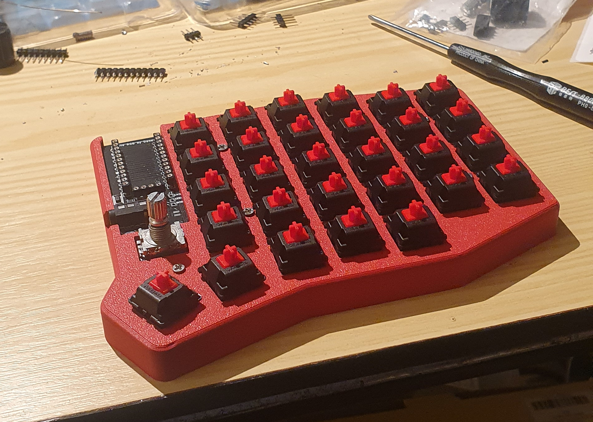
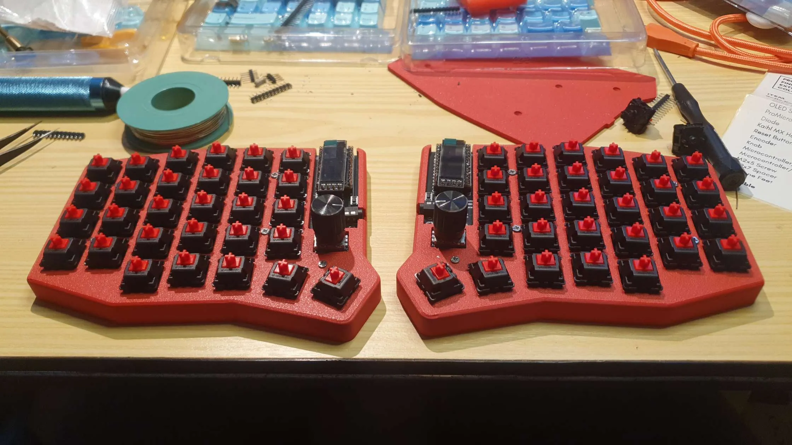
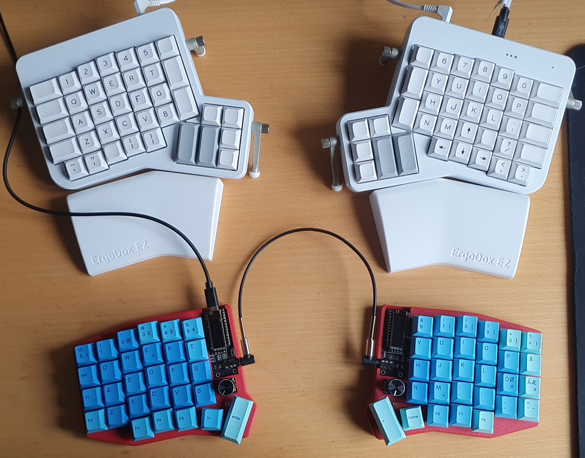
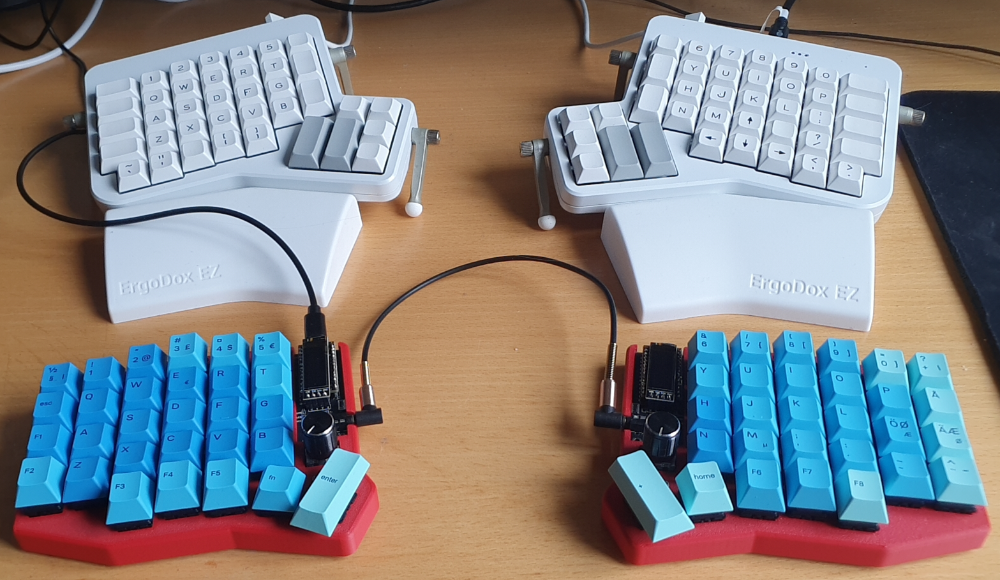

# Sofle V2.1 RGB DIY from ErgoFrets (assembled by yours truly)

---

# Default QMK firmware for ErgoFrets Sofle Keyboard
If you're seeing this, that probably means that you have an [ErgoFrets Sofle Keyboard](https://www.etsy.com/listing/1273810417/sofle-keyboard)
and you probably want to further customize it.

All the default keymaps can be configured using [VIA]()

If you want to configure the firmware specifically for the OLED and do some cool stuff with the rotary encoders,
you're best bet is to write some firmware yourself. There's lots of tutorials out there, so down below you'll see some [Useful Links](#Useful-Links)

## Setting up your QMK environment and writing your first firmware

1. To setup the environment, QMK have a very excellent [guide](https://github.com/qmk/qmk_firmware/blob/master/docs/newbs_getting_started.md) to get you started.

   > NOTE: While you can always manually clone it, if you already have a github account, it's reccommended you fork the official qmk repository. More details are in the guide.

2. Once you're environment is setup and you test that you are able to compile, you now ready to start [Building your first firmware](https://github.com/qmk/qmk_firmware/blob/master/docs/newbs_building_firmware.md).

3. Finally, you can start testing your new keymap by [Flashing your firmware](https://github.com/qmk/qmk_firmware/blob/master/docs/newbs_flashing.md).

## I'm done with setting up my environment, now what?

Once you're done setting up your environment and have tested that everything works as expected, you can go ahead and copy this repository's source code into a custom keymap.

copy the source code to here `qmk_firmare/keyboards/sofle/keymaps/<your_name>`

> NOTE: The ErgoFrets sofle uses as RP2040 microcontroller, which flashes in a different way than the regular MCUs. So when compiling make sure to add the following flags...
>
> `qmk compile -kb <keyboard> -km <keymap> -e CONVERT_TO=promicro_rp2040`
>
> Then drag and drop the .uf2 file directly to the microcontroller massive storage unit that appears when putting it into boot mode

## FAQ

> Q: I don't really know what I'm doing, can I brick my keyboard?

yurikhan on reddit said it best.

Quote,

The worst thing that may happen is that you screw up so badly that the flashing utility cannot switch your keyboard
into bootloader mode over USB to flash the new firmware.
If that happens, you’ll need to press the reset button on your keyboard. And if there is no reset button, then you’ll have to get to the PCB, find the microcontroller chip, read the label on its top, google for the datasheet, find out which pin is the reset pin, and briefly connect it to the ground.

So yes, you can brick your keyboard, and no, it’s not permanent.

Endquote.

> Q: How can I enter DFU mode so I can flash?

The easiest way is to bind the `RESET` key on VIA to your preferred location, and that will prepare that half of the board to be flashed.

> Q: Can I flash this board with QMK toolbox?

No. QMK toolbox does not currently support flashing RP2040 microcontroller boards. To flash this board,
Enter DFU mode, and you will see a usb-drive popup on your system, open the drive and copy the `.uf2` file
which is your compiled firmware into the drive and wait for the keyboard to become visible.

PLEASE CHECK THE OFFICIAL DOCS ON [THIS](https://docs.qmk.fm/#/flashing?id=raspberry-pi-rp2040-uf2)

> Q: I just flashed my keyboard, and the left/right half isn't registering anything!

When flashing a split board, each half has it's own microcontroller so you will need to flash each half.

## Useful links

- [OLED displays with QMK](https://youtu.be/OJSOEStpPIo?si=KoERjp1IAvCBEIxC)
- [VIA setup](https://youtu.be/7d5yzBOup9U?si=1MO5OTbQLLwgUlAW)
- [Vial setup](https://youtu.be/O8pdUPqPG3k?si=IrUdmYJw8IY3q91S)
- [Easy to digest visual guide](https://youtu.be/AA8fw2MbpYg?si=Xdqg4gY-U7xlSWjz)
